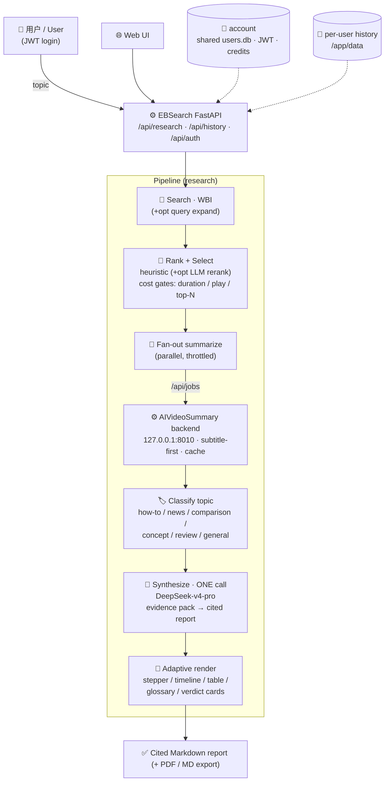

<div align="center">

# EBSearch · 一个主题，一份 B 站综述报告

**输入一个主题，拿到一份有引用、自适应排版的研究报告——素材来自全站最相关的 B 站视频。**

_Give it a topic; get one cited, adaptively-laid-out research report synthesized from the most relevant Bilibili videos._

[](#-license--许可)
[](pyproject.toml)
[](https://fastapi.tiangolo.com/)
[](Dockerfile)
[](pyproject.toml)
[](#)

[功能亮点](#-功能亮点--features) · [架构](#️-架构--architecture) · [快速开始](#-快速开始--quickstart) · [报告类型](#-自适应报告类型--adaptive-report-types) · [路线图](#-路线图--roadmap)

</div>

> 这是一个双产品套件的一部分 · *Part of a two-product suite:*
> [**AIVideoSummary**](https://github.com/oliver-zhang987/AIVideoSummary)（单个视频 → 摘要）+ **EBSearch**（一个主题 → 综述报告，本仓库，**复用**前者的后端）。

---

## 中文版

### 一个故事

你想搞懂一个主题——「大语言模型 RAG 检索增强」「向量数据库怎么选」——但 B 站搜索给你几十条视频，
你不可能一条条看完。**EBSearch** 替你做了：它在全站搜出最相关的视频，挑出最好的 N 个，
**复用 [AIVideoSummary](https://github.com/oliver-zhang987/AIVideoSummary) 后端**把每个视频各自摘要好，再用一个更强的模型
（DeepSeek-v4-pro）**合成一份带引用的报告**——而且会**根据主题类型自动换排版**：
教程给你带时间戳的步骤条，新闻给你时间线，对比给你表格，概念给你术语表，测评给你结论卡。

把「看几小时视频做调研」压缩成「读一页报告」。

### ✨ 功能亮点 / Features

| | 能力 | 说明 |
|---|---|---|
| 🔎 | **WBI 搜索** | B 站 `wbi/search/type`（WBI 签名 + cookies + UA/Referer），按相关性取候选 |
| 🏅 | **启发式排序** | 透明、确定、零依赖的打分：命中列 + 播放量 + 时长契合 + 新鲜度 + 位置衰减。**实测 `rank_score` 为空，故不依赖它** |
| 🤖 | **可选 LLM 重排** | 对启发式幸存者做一次廉价模型重排（出错则回退启发式顺序）|
| 🚪 | **成本闸门** | 时长/播放量硬过滤 + `max_videos` 上限——**先筛后摘**，不浪费 |
| 🔁 | **fan-out 摘要** | 每个视频复用 AIVideoSummary 后端 `/api/jobs`（并发、限流、字幕优先、缓存复用）|
| 🧠 | **一次强模型合成** | 全流程**只用一次** DeepSeek-v4-pro：总览 / 子主题 / 共识 vs 分歧 / 逐视频亮点 / 推荐观看顺序 |
| 🎨 | **自适应排版** | 按报告类型（how-to / news / comparison / concept / review / general）切换版式 |
| 📎 | **可追溯引用** | 每条论断带 `[n]` 来源标注；时间戳只能取自证据包，模型无法编造 |
| 👤 | **按用户历史** | 每个用户的报告独立持久化，重启不丢；可删除 |
| 📤 | **导出** | 报告可导出 PDF / Markdown |

### 🎨 自适应报告类型 / Adaptive report types

主题先被分类（廉价 LLM + 离线关键词启发式兜底），合成与渲染都按类型切换：

| 报告类型 | 触发信号（示例）| 专属版式 |
|---|---|---|
| `how_to` | 怎么、如何、教程、搭建、入门 | 带时间戳的**有序步骤条** |
| `news` | 最新、事件、发布、新闻、时间线 | **时间线** |
| `comparison` | 对比、vs、哪个好、区别 | **对比矩阵表**（维度 × 对象）|
| `concept` | 是什么、原理、科普、为什么 | **术语表** |
| `review` | 测评、评测、值不值、开箱、体验 | **结论卡片**（结论/评分/优缺点）|
| `general` | 以上都不明显 | 默认结构化版式 |

### 🛠️ 工作原理 / How it works


> **TODO:** 录制一段演示 GIF 放到 `docs/demo.gif`（输入主题 → 进度条 候选→筛选→摘要→合成 → 渲染报告）。

1. **搜索** —— WBI 签名搜全站，可选 LLM 查询扩展。
2. **排序 + 选取** —— 启发式打分 + 硬过滤，可选廉价 LLM 重排，取 top-N。
3. **fan-out 摘要** —— 每个视频调 AIVideoSummary 后端摘要（并发提交、轮询；人工字幕直接用，仅 AI 字幕在开启 ASR 时强制重新转写）。
4. **合成** —— 把所有逐视频要点打包成「证据包」，一次 DeepSeek-v4-pro 调用生成报告。
5. **渲染** —— 按报告类型自适应渲染 Markdown（+ JSON），写入按用户历史。

### 🚀 快速开始 / Quickstart

```bash
# 1. 安装（核心仅标准库，零 pip 依赖；server/dev 需 extras）
pip install -e '.[server]'        # + FastAPI/uvicorn（API + Web UI）
# pip install -e '.[dev]'         # + pytest/httpx 跑测试

# 2. 配置
cp .env.example .env
#   关键：EBS_LLM_API_KEY（合成用），EBS_BACKEND_URL 指向运行中的 AIVideoSummary 后端
#        （默认 http://127.0.0.1:8010）；后端若设了 VS_API_KEY 则填 EBS_BACKEND_API_KEY

# 3. CLI（Markdown 打到 stdout）
ebsearch "大语言模型 RAG 检索增强"
ebsearch "向量数据库怎么选" --max 4 --duration 2 --rerank --out report.md

# 4. 起 API + Web UI（默认 0.0.0.0:8020；research() 约 1–2 分钟/主题）
python -m ebsearch.server.app        # 或：ebsearch-server
# 打开 http://localhost:8020/ ，输入主题 → 流式进度 → 渲染报告
```

```bash
# REST：起任务（HTTP 202）→ 轮询
curl -sX POST localhost:8020/api/research \
  -H 'Content-Type: application/json' \
  -d '{"topic":"大语言模型 RAG 检索增强","max_videos":4,"allow_llm_rerank":true}'
curl -s localhost:8020/api/research/<job_id>     # status / progress / markdown / report
```

**Docker**（生产里与 AIVideoSummary 后端共驻一机，走 `--network host` + nginx 终止 TLS）：

```bash
docker build -t ebsearch:latest .
docker run -d --name ebsearch --restart unless-stopped --network host -m 300m \
  --env-file .env \
  -v /opt/videosummary/cookies.txt:/app/cookies.txt:ro \
  -v /opt/ebsearch/data:/app/data \
  ebsearch:latest
# 容器默认绑定 127.0.0.1:8020（见 Dockerfile）。一键部署脚本见 deploy/deploy.sh
```

### 🔐 账户与额度 / Account & Credits

EBSearch 内置与 [AIVideoSummary](https://github.com/oliver-zhang987/AIVideoSummary) **共享的**、仅标准库的 `account` 包
（SQLite `users.db` + 手写 HS256 JWT + 积分账本 + OTP）：

- **统一登录**：手机号 + 邀请码 + 短信 OTP，**一次登录两边都认**——两个服务指向同一个 `users.db`，并导出相同的 `AUTH_PHONE_SALT` / `AUTH_JWT_SECRET`。
- **报告计费**：起任务时预扣 `base + per_video × N`（pro 合成模型再加价），**失败或空结果自动退款**。
- **价格环境变量可配**：`COST_REPORT_BASE`（默认 10）/ `COST_REPORT_PER_VIDEO`（默认 8）/ `COST_SYNTH_PRO_EXTRA`（默认 10）。

创建邀请码（管理脚本）：

```bash
python -c "from ebsearch.account import create_invite_code as c; print(c('WELCOME2026', 200, 100))"
```

### 🗺️ 关键环境变量

| 变量 | 默认 | 作用 |
|---|---|---|
| `EBS_BACKEND_URL` / `EBS_BACKEND_API_KEY` | `http://127.0.0.1:8010` / — | 复用的 AIVideoSummary 后端地址 + 服务密钥 |
| `EBS_LLM_API_KEY` / `EBS_LLM_BASE_URL` | — / `https://api.deepseek.com` | 合成/重排/扩展用的 LLM |
| `EBS_SYNTH_MODEL` | `deepseek-v4-pro` | 合成模型（那一次强模型调用）|
| `EBS_SYNTH_BASE_URL` / `_API_KEY` / `_PROXY` | — | 合成可换 provider 并经海外 relay（如 Groq gpt-oss-120b）|
| `EBS_MAX_VIDEOS` | `4` | 每主题摘要的视频数（成本主闸门之一）|
| `EBS_DURATION_FILTER` | `2` | 时长筛选（0 全部 / 1 <10m / 2 10–30m / 3 30–60m / 4 >60m）|
| `EBS_ALLOW_ASR` | `false` | 仅 AI 字幕的视频是否强制 ASR 重转 |
| `EBS_ALLOW_LLM_RERANK` | `false` | 是否启用廉价 LLM 重排 |
| `EBS_HOST` / `EBS_PORT` | `0.0.0.0` / `8020` | 服务监听 |
| `EBS_SERVER_API_KEY` / `EBS_CORS_ORIGINS` | — / `*` | `/api/*` 服务密钥 / CORS |

完整列表见 [`.env.example`](.env.example)。

---

## English

### The story

You want to understand a topic — "RAG for LLMs," "which vector database to pick" — but Bilibili
search hands you dozens of videos and you can't watch them all. **EBSearch** does it for you:
it searches the whole site for the most relevant videos, picks the best N, summarizes each one
by **reusing the [AIVideoSummary](https://github.com/oliver-zhang987/AIVideoSummary) backend**, then synthesizes **one cited report**
with a stronger model (DeepSeek-v4-pro) — and **adapts the layout to the topic type**: a
timestamped stepper for how-tos, a timeline for news, a comparison table for matchups, a glossary
for concepts, verdict cards for reviews. Hours of watching, compressed into one page.

### ✨ Features

| | Capability | Notes |
|---|---|---|
| 🔎 | **WBI search** | Bilibili `wbi/search/type` (WBI-signed + cookies + UA/Referer), relevance order |
| 🏅 | **Heuristic ranking** | Transparent, deterministic, dependency-free score: hit-columns + play + duration fit + recency + position decay. **`rank_score` is NULL in practice — we don't rely on it** |
| 🤖 | **Optional LLM rerank** | One cheap-model rerank of heuristic survivors (falls back to heuristic order on error) |
| 🚪 | **Cost gates** | Hard duration/play prefilter + `max_videos` cap — filter *before* you summarize |
| 🔁 | **Fan-out summarize** | Each video reuses the AIVideoSummary backend `/api/jobs` (parallel, throttled, subtitle-first, cache reuse) |
| 🧠 | **One strong-model synthesis** | Exactly **one** DeepSeek-v4-pro call: overview / themes / consensus vs. disagreement / per-video highlights / ranked watch list |
| 🎨 | **Adaptive presentation** | Layout switches by report type (how-to / news / comparison / concept / review / general) |
| 📎 | **Traceable citations** | Every claim carries an `[n]` source tag; timestamps may only come from the evidence pack, so they can't be invented |
| 👤 | **Per-user history** | Each user's reports persist independently across restarts; deletable |
| 📤 | **Export** | PDF / Markdown |

### 🛠️ How it works

1. **Search** — WBI-signed site-wide search, with optional LLM query expansion.
2. **Rank + select** — heuristic score + hard filters, optional cheap-LLM rerank, take top-N.
3. **Fan-out summarize** — call the AIVideoSummary backend per video (concurrent submit + poll; human subtitles used directly, AI-only captions re-transcribed via `force_asr` when ASR is enabled).
4. **Synthesize** — pack all per-video points into an evidence pack; one DeepSeek-v4-pro call produces the report.
5. **Render** — adaptive Markdown (+ JSON) by report type, saved to per-user history.

### 🚀 Quickstart

```bash
pip install -e '.[server]'                         # core is stdlib-only; server adds FastAPI/uvicorn
cp .env.example .env                                # set EBS_LLM_API_KEY + point EBS_BACKEND_URL at AIVideoSummary
ebsearch "大语言模型 RAG 检索增强"                   # CLI: Markdown to stdout
python -m ebsearch.server.app                       # API + Web UI at http://localhost:8020
```

Docker: see the run command in the Chinese section above and `deploy/deploy.sh`. Mint an invite code:

```bash
python -c "from ebsearch.account import create_invite_code as c; print(c('WELCOME2026', 200, 100))"
```

### 🔐 Account & Credits

The same stdlib-only `account` package as [AIVideoSummary](https://github.com/oliver-zhang987/AIVideoSummary) (SQLite `users.db` +
hand-rolled HS256 JWT + credits ledger + OTP) gives **one unified login** (phone + invite code +
SMS OTP) across both products — one login works on both because they share the same `users.db`
and the same `AUTH_PHONE_SALT` / `AUTH_JWT_SECRET`. Reports are charged up front
(`base + per_video × N`, plus a pro-synthesis extra) and refunded on failure / empty result. All
costs are env-configurable (`COST_REPORT_BASE`, `COST_REPORT_PER_VIDEO`, `COST_SYNTH_PRO_EXTRA`).

---

## 🏗️ 架构 / Architecture



---

## 🔭 路线图 / Roadmap

- [ ] 录制并附上演示 GIF（`docs/demo.gif`）/ Record & ship a demo GIF
- [ ] 报告内嵌可播放的时间戳跳转 / Inline playable timestamp jumps in the report
- [ ] 更多报告类型与版式（如学术综述 / 榜单）/ More report types & layouts
- [ ] 流式合成（边写边渲染）/ Streaming synthesis (render as it writes)
- [ ] 报告间的主题去重与增量更新 / Topic dedup & incremental report updates

---

## 📦 项目结构 / Layout

```
ebsearch/
  search/       WBI 签名搜索客户端 + 查询计划 + 字幕抓取（仅标准库）
  rank/         启发式打分 + 选取（可选 LLM 重排）
  classify/     主题分类 → 报告类型（LLM + 离线关键词兜底）
  summarize/    fan-out：复用 AIVideoSummary 后端逐视频摘要
  synthesize/   一次强模型合成 → 带引用的 TopicReport
  render/        按报告类型自适应渲染 Markdown
  account/       与 AIVideoSummary 共享的登录 + JWT + 积分 + OTP（仅标准库）
  server/        FastAPI 应用 (/api/research, /api/history, /api/auth/*)
  pipeline.py    端到端编排：topic → report
deploy/         一键部署脚本（Docker + nginx + 共享 cookies/keys）
```

## 📄 License / 许可

MIT
